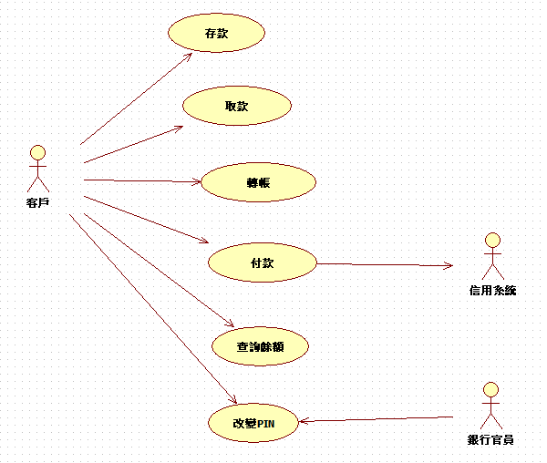
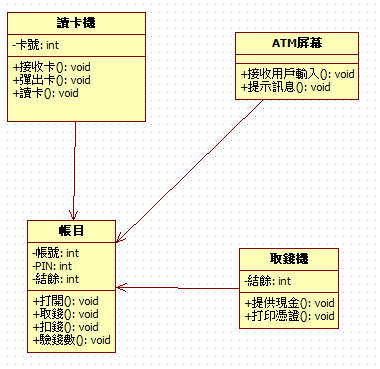
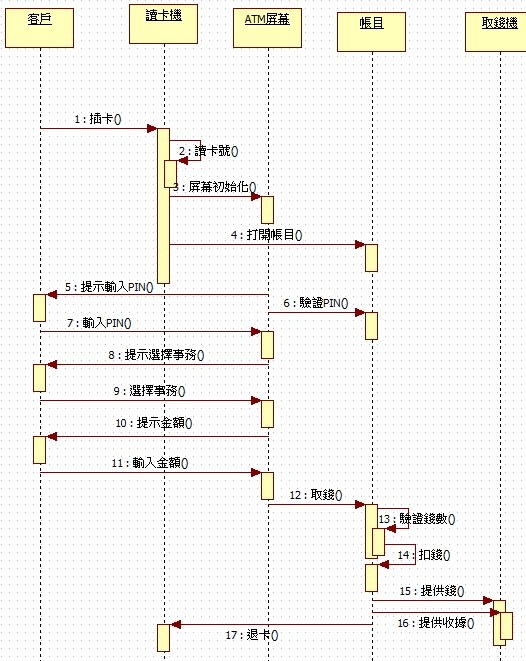
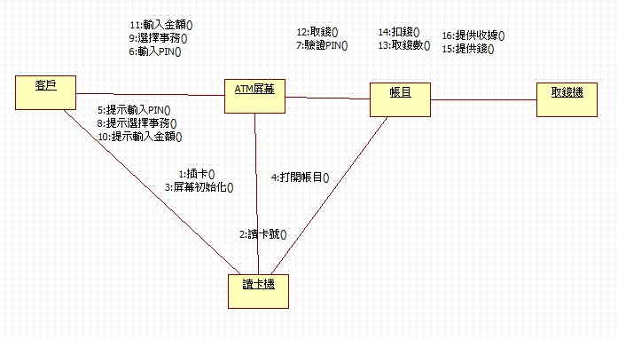
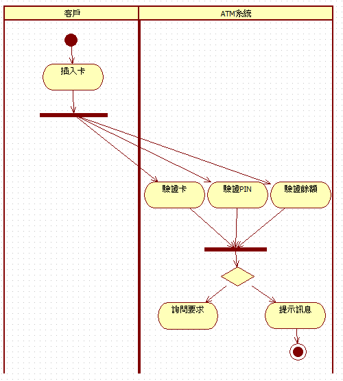

ATM 系統的用例圖、類圖、順序圖、協作圖、活動圖設計

用例圖

分析：對於銀行的客戶來說，可以通過ATM機啟動幾個用例：存款、取款、查閱結餘、付款、轉帳和改變PIN（密碼）。 
銀行官員也可以啟動改變PIN這個用例。 參與者可能是一個系統，這裡信用系統就是一個參與者，因為它是在ATM系統之外的。 
箭頭從用例到參與者表示用例產生一些參與者要使用的資訊。 這裡付款用例向信用系統提供信用卡付款資訊。

類圖

分析：類圖顯示了取款這個用例中各個類之間的關係，由四個類完成：讀卡機、帳目、ATM螢幕和取錢機。 類圖中每個類都是用方框表示的，分成三個部分。 第一部分是類名; 第二部分是類包含的屬性，屬性是類和相關的一些資訊，如帳目類包含了三個屬性：帳號、PIN（密碼）和結餘; 最後一部分包含類的方法，方法是類提供的一些功能，例如帳目類包含了四個方法：打開、取錢、扣錢和驗錢數。
 類之間的連線表示了類之間的通信關係。 例如，帳目類連接了ATM屏幕，因為兩者之間要直接相互通信; 取錢機和讀卡機不相連，因為兩者之間不進行通信。
 有些屬性和方法的左邊有一個小鎖的圖示，表示這個屬性和方法是private的（UML中用』-『表示），該屬性和方法只在本類中可訪問。 沒有小鎖的，表示public（UML中用』+『表示），即該屬性和方法在所有類中可訪問。 若是一個鑰匙圖示，表示protected（UML中用'#'表示），即屬性和方法在該類及其子類中可訪問。

 

 順序圖
 
分析：假設客戶Joe取20美元，它的序列圖：序列圖顯示了用例中的功能流程。 我們對取款這個用例分析，它有很多可能的程式，如想取錢而沒錢，想取錢而PIN錯等等，正常的情況是取到了錢，下面的序列圖就對某客戶Joe取20美元，分析它的序列圖。
 序列圖的頂部一般先放置的是取款這個用例涉及的參與者，然後放置系統完成取款用例所需的物件，每個箭頭表示參與者和對象或對象之間為了完成特定功能而要傳遞的消息。
 取款這個用例從客戶把卡插入讀卡機開始，然後讀卡機讀卡號，初始化ATM螢幕，並打開Joe的帳目物件。 螢幕提示輸入PIN，Joe輸入PIN（1234），然後屏幕驗證PIN與帳目對象，發出相符的資訊。 螢幕向Joe提供選項，Joe選擇取錢，然後螢幕提示Joe輸入金額，它選擇20美元。 然後螢幕從帳目中取錢，啟動一系列帳目物件要完成的過程。 首先，驗證Joe帳目中至少有20美元; 然後，它從中扣掉20美元，再讓取錢機提供20美元的現金。 Joe的帳目還讓取錢機提供收據，最後它讓讀卡機退卡。

 

 協作圖
 
分析：協作圖顯示的資訊和序列圖是相同的，只是協作圖用不同的方式顯示而已。 序列圖顯示的是對象和參與者隨時間變化的交互，而協作圖則不參照時間而顯示對象與參與者的交互。
 例如，Joe取20美元的協作圖中我們可以看到，讀卡機和Joe的帳目兩個對象之間的交互：讀卡機指示Joe的帳目打開，Joe的帳目讓讀卡機退卡。 直接相互通信的對象之間有一條直線，例如ATM螢幕和讀卡機直接相互通信，則其間畫一條直線。 沒有畫直線的對象之間不直接通信。

活動圖

分析：客戶插入信用卡之後，可以看到ATM系統運行了三個併發的活動：驗證卡、驗證PIN（密碼）和驗證餘額。 這三個驗證都結束之後，ATM系統根據這三個驗證的結果來執行下一步的活動。 如果卡正常、密碼正確且通過餘額驗證，則ATM系統接下來詢問客戶有哪些要求也就是要執行什麼操作。 如果驗證卡、驗證PIN（密碼）和驗證餘額這三個驗證有任何一個通不過的話，ATM系統就把相應的出錯資訊在ATM螢幕上顯示給客戶。

資料來源:https://cloud.tencent.com/developer/article/1751593
